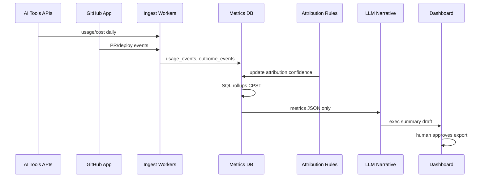

# Outcome Ledger — Product Requirements Document (PRD)

**Product:** Outcome Ledger (standalone; not Authon / Agent Money)  
**Version:** 0.1 (MVP)  
**Status:** Draft  
**Last updated:** June 2026

---

## 1. Summary

Outcome Ledger connects **AI tool spend** to **accepted work outcomes** (e.g. shipped PRs) and reports **cost per successful outcome (CPST)**. This PRD defines:

1. **How we integrate AI and engineering tools** (ingest, normalize, attribute).  
2. **How analysis runs** (deterministic metrics + optional LLM layers).  
3. **What we build in MVP vs later.**

**North-star metric:**

```text
CPST = fully_loaded_cost(workflow, period) / count(accepted_outcomes(workflow, period))
```

---

## 2. Goals & non-goals

### 2.1 Goals (MVP)

| ID | Goal |
|----|------|
| G1 | Ingest spend from **≥3 AI sources** (OpenAI, Anthropic, Cursor/Claude Code) without custom agent instrumentation |
| G2 | Ingest **GitHub** outcomes (merge, revert, deploy proxy) |
| G3 | Attribute spend to **team / repo / workflow** with ≥80% of spend tagged (not “unknown”) |
| G4 | Compute **CPST** and **failure cost share** per team and workflow template |
| G5 | Generate **executive summary** (LLM-assisted, human-reviewable) from computed metrics only |
| G6 | Export CSV + PDF board pack in &lt;5 min after sync |

### 2.2 Non-goals (MVP)

- Real-time blocking of AI usage (not a gateway).  
- Storing full prompts/completions by default.  
- Authon / Agent Money integration.  
- Customer NPS / revenue attribution (Phase 2).  
- Self-serve billing for Outcome Ledger (design partners only).

---

## 3. Users & jobs

| User | Job to be done |
|------|----------------|
| **CTO / VP Eng** | “Prove coding-AI budget is worth renewing.” |
| **CFO / FP&A** | “One defensible number for AI engineering ROI.” |
| **Platform / AI FinOps** | “Which team/tool burns cash without shipping?” |
| **Eng director** | “Fair comparison of squads — cost per merged PR that stuck.” |

---

## 4. Integration strategy — all AI tools

### 4.1 Design principle: **ingest, don’t intercept**

We do **not** require every LLM call to route through our proxy on day one. We combine:

| Tier | Method | Tools | Effort | Coverage |
|------|--------|-------|--------|----------|
| **A** | Official **billing / usage API** | OpenAI, Anthropic | Low | Org-level $ + tokens |
| **B** | **Admin export** (CSV) | Cursor, Claude Code, Copilot (admin) | Low | Monthly true-up |
| **C** | **Observability export** (OTel → Langfuse) | Any app instrumented | Medium | Per-feature/team if tagged |
| **D** | **SCIM / SSO logs** (optional) | Seat counts, active users | Low | License $ allocation |
| **E** | **Manual upload** | Any vendor | Lowest | Pilot fallback |

**Engineering outcomes** always come from **GitHub** (MVP), later GitLab, Linear, Jira, CI/CD.

```text
┌─────────────┐  ┌─────────────┐  ┌─────────────┐
│ OpenAI API  │  │ Anthropic   │  │ Cursor CSV  │
│ Usage API   │  │ Cost API    │  │ Claude CSV  │
└──────┬──────┘  └──────┬──────┘  └──────┬──────┘
       │                │                │
       └────────────────┼────────────────┘
                        ▼
              ┌──────────────────┐
              │  Ingestion Layer  │
              │  normalize $/tok  │
              └────────┬─────────┘
                       ▼
              ┌──────────────────┐
              │ Attribution Engine│◄── GitHub App (PR, merge, revert)
              │  (rules + ML)     │◄── Langfuse (optional tags)
              └────────┬─────────┘
                       ▼
              ┌──────────────────┐
              │ Metrics Store     │
              │ CPST, failures    │
              └────────┬─────────┘
                       ▼
              ┌──────────────────┐
              │ Report + LLM层    │
              │ exec narrative    │
              └──────────────────┘
```

### 4.2 Tool-by-tool integration spec

#### OpenAI

| Field | Detail |
|-------|--------|
| **Auth** | Org Admin API key (read usage) |
| **Endpoints** | Usage/Cost APIs (org daily granularity); Projects API if customer uses projects per team |
| **Pull cadence** | Daily cron + backfill 90 days on connect |
| **Raw fields** | `date`, `project_id`, `model`, `input_tokens`, `output_tokens`, `cost_usd` |
| **Attribution** | Map `project_id` → team via customer config table |

#### Anthropic

| Field | Detail |
|-------|--------|
| **Auth** | Admin API key |
| **Endpoints** | Cost / usage reporting (org-level) |
| **Pull cadence** | Daily |
| **Raw fields** | `date`, `workspace`, `model`, tokens, `cost_usd` |
| **Attribution** | Workspace → team mapping |

#### Cursor

| Field | Detail |
|-------|--------|
| **Auth** | None (MVP): admin uploads **billing export CSV** |
| **Phase 2** | Cursor Teams API if/when available |
| **Raw fields** | `user_email`, `period`, `subscription_cost`, `usage_overages` |
| **Attribution** | `user_email` → GitHub handle → team (directory sync) |

#### Claude Code (Anthropic product line)

| Field | Detail |
|-------|--------|
| **Auth** | Same Anthropic org OR separate export |
| **Method** | Per-engineer usage CSV (Uber-style) + Anthropic consolidated bill |
| **Raw fields** | `engineer_id`, `tokens`, `cost_usd`, `period` |
| **Attribution** | Engineer → GitHub → team |

#### GitHub Copilot

| Field | Detail |
|-------|--------|
| **Auth** | GitHub Enterprise **Copilot metrics API** (if licensed) OR billing CSV |
| **Raw fields** | Acceptances, suggestions, active users per org/team |
| **Note** | Copilot $ often **per-seat**; allocate seat cost × active days to team |

#### Langfuse (optional accelerator)

| Field | Detail |
|-------|--------|
| **Auth** | Langfuse API keys (project-scoped) |
| **Method** | Pull traces/metrics API; require tags: `team.id`, `feature.id`, `workflow.id` |
| **Value** | Best **per-PR / per-feature** token attribution when eng already instruments apps |
| **Doc reference** | OTel GenAI semantic conventions |

#### LiteLLM / Helicone (Phase 2)

| Field | Detail |
|-------|--------|
| **Role** | If customer already uses gateway, ingest their export instead of raw OpenAI |
| **Benefit** | Pre-tagged `team_id` on every call |

#### GitHub (outcomes — required MVP)

| Field | Detail |
|-------|--------|
| **Auth** | GitHub App (read: metadata, PRs, commits, deployments, members) |
| **Events** | `pull_request` merged/closed, `deployment_status`, `push` (revert detection) |
| **Outcome signals** | See §6 |
| **Link to spend** | PR author + merged_at window ↔ engineer AI spend in same period |

#### Future (post-MVP)

| Tool | Method |
|------|--------|
| GitLab | Same as GitHub App pattern |
| Linear / Jira | Initiative ID → PR labels |
| Amplitude / Segment | Outcome = feature flag on + metric delta |
| AWS Cost Explorer | Bedrock line items |
| Microsoft Copilot Studio | Admin center export |

### 4.3 Unified ingest schema (canonical)

All sources normalize to **`usage_events`**:

```json
{
  "event_id": "uuid",
  "org_id": "uuid",
  "source": "openai|anthropic|cursor|langfuse|copilot|manual",
  "period_start": "2026-03-01T00:00:00Z",
  "period_end": "2026-03-31T23:59:59Z",
  "cost_usd": 1234.56,
  "input_tokens": 1000000,
  "output_tokens": 200000,
  "model": "gpt-4.1",
  "attribution": {
    "team_id": "platform-payments",
    "user_id": "eng@company.com",
    "repo": "org/checkout-service",
    "workflow_id": "ship-fix",
    "feature_id": null,
    "confidence": 0.85
  },
  "raw_ref": "s3://.../openai_2026-03.json"
}
```

All outcomes normalize to **`outcome_events`**:

```json
{
  "outcome_id": "uuid",
  "org_id": "uuid",
  "type": "pr_merged_stable|deploy_prod|manual_customer_feature",
  "accepted": true,
  "occurred_at": "2026-03-15T14:00:00Z",
  "team_id": "platform-payments",
  "repo": "org/checkout-service",
  "pr_number": 4821,
  "metadata": { "revert_within_7d": false, "lines_changed": 120 }
}
```

---

## 5. Attribution — how spend meets outcomes

### 5.1 Attribution ladder (priority order)

| Level | Rule | Confidence |
|-------|------|------------|
| L1 | Langfuse tag `team.id` + `workflow.id` on trace | High |
| L2 | OpenAI **project** ↔ team mapping (customer config) | High |
| L3 | Engineer email (Cursor/Claude) ↔ GitHub user ↔ team from org chart | Medium |
| L4 | Repo ownership file (`CODEOWNERS`) → team for unattributed org spend | Medium |
| L5 | Pro-rata: split unknown spend by team headcount or merged-PR share | Low (flagged) |

**UI rule:** Dashboard shows **attributed %**; CFO export footnotes unknown bucket.

### 5.2 Time-window linking

For each **accepted outcome** (PR merged):

```text
cost_window = [merge_time - 14d, merge_time + 2d]
attributed_spend = sum(usage_events where user in PR participants AND t in cost_window)
```

PR participants = author + reviewers + committers on branch.

---

## 6. Outcome definitions (acceptance gates)

Configurable per org; MVP defaults:

| Outcome type | Accepted when | Rejected / failed |
|--------------|---------------|-------------------|
| **`pr_merged_stable`** | PR merged to default branch AND no revert of same files within **7 days** | Reverted, closed without merge |
| **`deploy_prod`** | Deployment to `production` environment within **14d** of merge | No prod deploy |
| **`manual_customer_feature`** | PM tags initiative “customer-visible” + merge | — |

**CPST denominator:** only `accepted = true` outcomes.  
**Numerator:** all spend in workflows tied to that team/period (includes failed PRs, abandoned work — “failures pay for successes”).

---

## 7. Analysis architecture — how the system runs

### 7.1 Core rule: **numbers are deterministic; LLM is explain-only**

| Layer | Engine | Purpose |
|-------|--------|---------|
| **L0 Ingest** | Python workers + cron | Pull APIs, parse CSV, validate schema |
| **L1 Normalize** | SQL / DuckDB | Dedupe, FX, unify units |
| **L2 Attribute** | Rules engine + optional ML | Tag team/workflow |
| **L3 Metrics** | SQL aggregates | CPST, failure share, percentiles |
| **L4 Narrative** | LLM (optional) | Exec summary from L3 tables only |
| **L5 Anomaly** | Stats + LLM assist | “Team X CPST 4× median — here’s why” |

**Never** let the LLM compute CPST directly (hallucination risk). LLM reads **precomputed JSON** and writes prose.

### 7.2 Pipeline jobs (MVP)

```text
on_org_connect:
  backfill_usage(90d) + backfill_github(90d)

daily_02_00_utc:
  sync_usage_all_sources()
  sync_github_events()
  run_attribution_job()
  compute_metrics_rollups()
  if weekly_monday: generate_exec_report()
```

### 7.3 Metrics computed (SQL)

| Metric | Formula |
|--------|---------|
| **CPST** | `sum(cost_usd) / count(accepted outcomes)` per team, workflow, period |
| **Failure cost share** | `cost(attributed to failed/abandoned) / total cost` |
| **Adoption efficiency** | `accepted outcomes / active_ai_users` |
| **P50 / P95 CPST** | Distribution per workflow (catch retry storms) |
| **Attributed spend %** | `tagged cost / total cost` |
| **Tool mix** | % spend by OpenAI vs Anthropic vs Cursor |

### 7.4 Where models (LLM) run — detailed

#### Job A: **Workflow classifier** (optional MVP, recommended Phase 1.5)

| Input | Output |
|-------|--------|
| PR title, labels, changed paths, commit messages | `workflow_id` e.g. `bugfix`, `feature`, `refactor`, `infra` |

| Setting | Value |
|---------|-------|
| Model | Small fast model (e.g. `gpt-4.1-mini` or Claude Haiku) |
| Prompt | Structured JSON output only; temperature 0 |
| Fallback | GitHub labels + path heuristics if LLM fails |
| Cost cap | Batch 500 PRs/run; max $5/org/day |

#### Job B: **Executive narrative** (MVP)

| Input | Output |
|-------|--------|
| Precomputed metrics JSON (no raw prompts) | 1-page memo: trends, outliers, 3 recommendations |

| Setting | Value |
|---------|-------|
| Model | Quality model (e.g. `gpt-4.1` or Claude Sonnet) |
| System prompt | “Only cite numbers present in JSON; mark uncertainty.” |
| Guardrails | Schema validate; redact team names if export flag set |
| Human | “Approve before send” toggle for design partners |

#### Job C: **Anomaly explainer** (Phase 2)

| Input | Output |
|-------|--------|
| Metric delta + top PRs + spend spike | Bulleted root-cause hypotheses (retry loop, model upgrade, new hire) |

#### Job D: **Initiative ↔ outcome linker** (Phase 2)

| Input | Output |
|-------|--------|
| Linear/Jira ticket + PRs | “This customer feature maps to 12 accepted outcomes” |

### 7.5 Model provider strategy

| Concern | Approach |
|---------|--------|
| **Vendor neutrality** | Org brings keys (BYOK) for narrative jobs; we use **our key** only for internal classifier if customer opts in |
| **Data sent to LLM** | Aggregates + PR metadata only; **no** customer prompt/completion text in MVP |
| **Audit** | Log prompt hash + model version + input row count per Job B run |

### 7.6 Analysis flow (end-to-end diagram)



---

## 8. Product surfaces (MVP)

### 8.1 Connect wizard

1. Create org → name teams → map OpenAI projects / Anthropic workspaces.  
2. Connect GitHub App (select repos).  
3. Connect OpenAI + Anthropic (API keys, read-only).  
4. Upload Cursor/Claude CSV (optional).  
5. Run first sync → show attribution coverage %.

### 8.2 Dashboard pages

| Page | Content |
|------|---------|
| **Overview** | Total AI spend, CPST org-wide, attributed %, trend 12 weeks |
| **Teams** | Table: team → spend → outcomes → CPST → failure share |
| **Tools** | Spend by vendor; idle seat warning (Copilot) |
| **Workflows** | CPST by workflow type (classifier) |
| **Outliers** | P95 CPST workflows; drill to PR list |
| **Reports** | Generate PDF/CSV; LLM memo tab |

### 8.3 API (internal MVP)

| Endpoint | Purpose |
|----------|---------|
| `POST /v1/orgs` | Create tenant |
| `POST /v1/connections/{provider}` | Store encrypted credentials |
| `POST /v1/imports/csv` | Manual upload |
| `POST /v1/sync` | Trigger ingest + metrics |
| `GET /v1/metrics/cpst` | Query rollups |
| `POST /v1/reports/executive` | Run LLM narrative job |

---

## 9. Data model (MVP tables)

| Table | Purpose |
|-------|---------|
| `organizations` | Customer tenant |
| `teams` | Internal team mapping |
| `connections` | Encrypted credentials per provider |
| `usage_events` | Normalized spend |
| `outcome_events` | Normalized outcomes |
| `attribution_links` | usage_id ↔ outcome_id, confidence |
| `metric_rollups_daily` | Precomputed CPST |
| `report_runs` | LLM job audit trail |
| `user_directory` | email ↔ github ↔ team |

---

## 10. Security & privacy

| Requirement | Implementation |
|-------------|----------------|
| Credentials | Vault/KMS encrypted; read-only API scopes |
| PII | Minimize; engineer email hashed optional |
| Prompts | Not stored in MVP |
| LLM calls | Aggregates only; DPA with model provider |
| GitHub | Least privilege App permissions |
| Export | SOC2 path Phase 2 |

---

## 11. Phased delivery

### Phase 0 — Diagnostic (2 weeks)

- CSV upload only: OpenAI export + GitHub API  
- Spreadsheet-quality CPST one-pager (manual)  
- 3 design partners

### Phase 1 — MVP (10 weeks)

| Week | Deliverable |
|------|-------------|
| 1–2 | Ingest OpenAI + Anthropic + GitHub; canonical schema |
| 3–4 | Attribution L2–L4; CPST SQL |
| 5–6 | Dashboard overview + teams |
| 7 | Cursor/Claude CSV import |
| 8 | Executive report (LLM Job B) |
| 9 | PDF/CSV export |
| 10 | Pilot hardening, attribution ≥80% |

### Phase 2 (12 weeks)

- Langfuse connector  
- Workflow classifier (LLM Job A)  
- Linear/Jira initiative link  
- Amplitude outcome webhook  
- Anomaly explainer (Job C)

### Phase 3

- Real-time gateway optional module  
- Customer metric outcomes (NPS, revenue)  
- Multi-org benchmarks (anonymized)

---

## 12. Success metrics (product)

| Metric | MVP target |
|--------|------------|
| Time to first CPST report | &lt; 24h after connect |
| Attribution coverage | ≥ 80% of $ |
| Design partner retention | 3/3 complete 8-week pilot |
| Exec report usefulness | ≥ 4/5 survey from CFO/CTO |
| LLM narrative edit rate | &lt; 30% paragraphs edited before export |

---

## 13. Risks

| Risk | Mitigation |
|------|------------|
| Vendor has no API | CSV upload path |
| Attribution wrong | Show confidence; manual override UI |
| LLM invents ROI | Numbers-only input to narrative job |
| GitHub ≠ all work | Document scope; add Jira Phase 2 |
| Copilot seat vs usage | Separate license allocation model |

---

## 14. Open decisions

| # | Question | Default |
|---|----------|---------|
| 1 | Product name final? | Outcome Ledger |
| 2 | BYOK vs our LLM key for reports? | BYOK for enterprise; our key for pilot |
| 3 | DuckDB vs Postgres for analytics? | Postgres MVP |
| 4 | First outcome gate strictness? | `pr_merged_stable` only |
| 5 | New repo name? | `outcome-ledger` |

---

## 15. Appendix — integration checklist per vendor

| Vendor | MVP | API/CSV | Auth | Team attribution |
|--------|-----|---------|------|------------------|
| OpenAI | ✅ | API | Admin key | Project map |
| Anthropic | ✅ | API | Admin key | Workspace map |
| Cursor | ✅ | CSV | Upload | Email → GitHub |
| Claude Code | ✅ | CSV + Anthropic | Upload | Engineer map |
| GitHub | ✅ | App | OAuth App | CODEOWNERS |
| Langfuse | ⬜ P2 | API | Project keys | Trace tags |
| Copilot | ⬜ P1.5 | API/CSV | GH Enterprise | Seats |
| LiteLLM | ⬜ P2 | Export | API | Pre-tagged |
| GitLab | ⬜ P3 | App | OAuth | CODEOWNERS |

---

*Outcome Ledger PRD v0.1 — standalone product. Implementation should live in a separate repository when engineering starts.*
